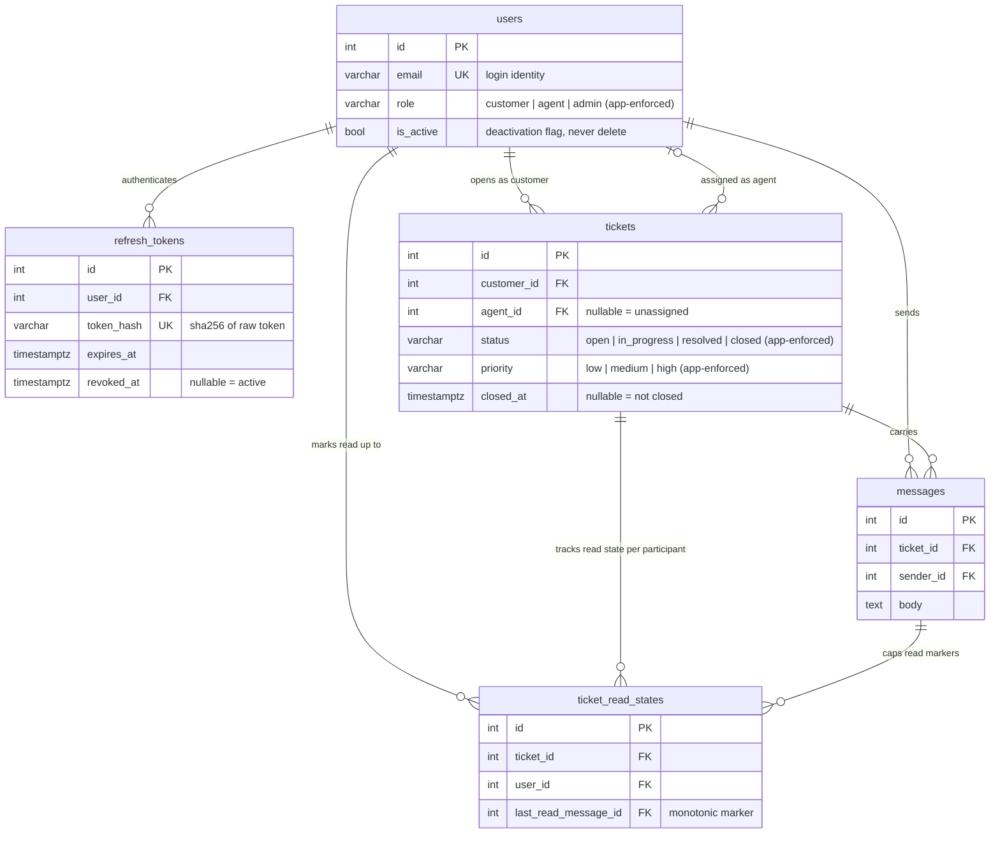

# Database Design — SupportSync

> **Source of truth.** The SQLModel classes in `backend/app/modules/*/models.py` and the Alembic migrations in `backend/migrations/versions/` are the single source of truth. **This document describes — it never prescribes.** If this doc and the models disagree, the models win and the doc is stale.
>
> **Verification stamp** — 2026-09-17: `alembic check` against the live Postgres (docker-compose) reports *"No new upgrade operations detected"* (zero drift between models and database); the full test suite is green on sqlite and Postgres. Constraint claims below (including "no CHECK constraints exist") were verified against the live database, not inferred from code.
>
> Maintained by the `database-schema-designer` skill (`.agents/skills/database-schema-designer/`): any change to models or migrations ships together with an update to this file.

## Schema at a glance

5 tables across 3 migrations (`0001` initial → `87e92c87d5e5` messages → `f679192f699c` ticket_read_states). Owned by modules per the modular-monolith rule (ADR 0002): users/auth own identity tables, tickets owns tickets, chat owns messages + read states.

The `|o--o{` on the agent relationship is the one nullable FK in the domain: a ticket starts unassigned. Every other FK is `NOT NULL` and required.

## Per-table specs

### `users` — module: `users` (migration 0001)

| Column | Type | Constraints | Notes |
|---|---|---|---|
| `id` | INTEGER | PK (serial) | |
| `email` | VARCHAR(320) | NOT NULL, UNIQUE (`ix_users_email`) | 320 = RFC max email length |
| `hashed_password` | VARCHAR(255) | NOT NULL | bcrypt hash — raw passwords never persisted |
| `full_name` | VARCHAR(200) | NOT NULL | |
| `role` | VARCHAR(20) | NOT NULL | App-enforced enum `customer / agent / admin` (`users.Role`). **No DB CHECK** — see imperfections |
| `is_active` | BOOLEAN | NOT NULL, default `true` | Deactivation flag (ADR 0004) |
| `created_at` / `updated_at` | TIMESTAMPTZ | NOT NULL | tz-aware UTC, app-side defaults; `updated_at` bumps on update |

**Indexes and why:**
- `ix_users_email` UNIQUE — the login path: every auth flow looks a user up by email. Uniqueness is the constraint *and* the index.

**Notes:** Deactivation, never deletion (ADR 0004): every other table references `users.id`, so identity records are permanent and access is revoked via `is_active = false`. `agent` is displayed as "Support Agent" per `CONTEXT.md`.

### `refresh_tokens` — module: `auth` (migration 0001)

| Column | Type | Constraints | Notes |
|---|---|---|---|
| `id` | INTEGER | PK (serial) | |
| `user_id` | INTEGER | NOT NULL, FK → `users.id`, indexed | |
| `token_hash` | VARCHAR(64) | NOT NULL, UNIQUE (`ix_refresh_tokens_token_hash`) | SHA-256 hex of the raw token — **the raw value is never stored** (ADR 0003) |
| `expires_at` | TIMESTAMPTZ | NOT NULL | ~7-day window |
| `revoked_at` | TIMESTAMPTZ | NULL | NULL = active; set on logout / password change |
| `created_at` | TIMESTAMPTZ | NOT NULL | |

**Indexes and why:**
- `ix_refresh_tokens_token_hash` UNIQUE — every refresh request presents a token; the lookup is by hash. Uniqueness also prevents one raw token mapping to two sessions.
- `ix_refresh_tokens_user_id` — revoke-by-user paths (logout-all, password change) and any per-user session listing.

**Notes:** Rotation on every use (ADR 0003): the presented token is revoked and a new row inserted, so a row is used at most once. "Usable" = `revoked_at IS NULL AND expires_at > now()` (computed in the model, not the DB). Expired/revoked rows accumulate by design — a purge job is future work.

### `tickets` — module: `tickets` (migration 0001)

| Column | Type | Constraints | Notes |
|---|---|---|---|
| `id` | INTEGER | PK (serial) | |
| `customer_id` | INTEGER | NOT NULL, FK → `users.id`, indexed | The opener; never changes |
| `agent_id` | INTEGER | NULL, FK → `users.id`, indexed | NULL = unassigned; assignment is the only identity edit allowed after creation |
| `title` | VARCHAR(200) | NOT NULL | Immutable after creation (ADR 0001) |
| `description` | TEXT | NOT NULL | Immutable after creation (ADR 0001) |
| `status` | VARCHAR(20) | NOT NULL, default `open`, indexed | App-enforced enum `open / in_progress / resolved / closed`; transitions governed by `tickets/policy.py` (ADR 0001) |
| `priority` | VARCHAR(20) | NOT NULL, default `medium`, indexed | App-enforced enum `low / medium / high` |
| `created_at` / `updated_at` | TIMESTAMPTZ | NOT NULL | tz-aware UTC |
| `closed_at` | TIMESTAMPTZ | NULL | Stamped when status → `closed`, which is terminal (ADR 0001) |

**Indexes and why:**
- `ix_tickets_customer_id` — "my tickets" for customers.
- `ix_tickets_agent_id` — the agent queue: "assigned to me", including the NULL (unassigned) case for pick-up flows.
- `ix_tickets_status` — queue filtering by status; the status column is also the lock for the policy table's transition rules.
- `ix_tickets_priority` — priority-sorted queues and filters.

**Notes:** FKs declare no `ON DELETE` action — deliberate under ADR 0004 (nothing is ever hard-deleted, so cascades would never fire). The lifecycle is *state, not history*: there is no transition-audit table (see imperfections).

### `messages` — module: `chat` (migration `87e92c87d5e5`, M2)

| Column | Type | Constraints | Notes |
|---|---|---|---|
| `id` | INTEGER | PK (serial) | Monotonic — read markers reference it directly |
| `ticket_id` | INTEGER | NOT NULL, FK → `tickets.id` | No separate index — leftmost column of the composite below |
| `sender_id` | INTEGER | NOT NULL, FK → `users.id` | Only participants can insert (chat policy); no index — by-sender queries don't exist |
| `body` | TEXT | NOT NULL | |
| `created_at` | TIMESTAMPTZ | NOT NULL | tz-aware UTC |

**Indexes and why:**
- `ix_messages_ticket_created` (`ticket_id`, `created_at`) — **the hot chat path**: history fetch is `WHERE ticket_id = ? ORDER BY created_at` (both the REST history endpoint and the WS open), and "latest message" lookups for read-marker comparisons hit the same shape. Composite order matches the query exactly.

**Notes:** Writes go through `chat/service` only (REST and the WS frame path share it) — authorization is the chat policy table's send rules, so no DB-level path can bypass it.

### `ticket_read_states` — module: `chat` (migration `f679192f699c`, M2 receipts)

| Column | Type | Constraints | Notes |
|---|---|---|---|
| `id` | INTEGER | PK (serial) | |
| `ticket_id` | INTEGER | NOT NULL, FK → `tickets.id`, indexed | Read-states endpoint filters by ticket |
| `user_id` | INTEGER | NOT NULL, FK → `users.id` | No index — covered by the unique composite |
| `last_read_message_id` | INTEGER | NOT NULL, FK → `messages.id` | **Monotonic**: the marker never moves backwards; repeats/backwards reads are silent no-ops |
| `updated_at` | TIMESTAMPTZ | NOT NULL | tz-aware UTC |

**Constraints:**
- `uq_read_state_ticket_user` UNIQUE (`ticket_id`, `user_id`) — one row per participant per ticket.

**Indexes and why:**
- `ix_ticket_read_states_ticket_id` — the read-states endpoint loads all markers for one ticket; the unique composite's leftmost column also serves point lookups by `(ticket_id, user_id)`.

**Notes:** Storage scales with *participants* (2 rows per ticket — customer + assigned agent), not messages. Rows are created lazily on the first receipt; admins are read-only observers and never get rows.

## Design decisions

| Decision | Why | Reference |
|---|---|---|
| Tickets immutable after creation; `closed` terminal; `closed_at` stamp | Clean audit trail, trivially enforceable permissions via the declarative policy table | ADR 0001 |
| Rotating, stored, hash-only refresh tokens | Revocability of leaked sessions — the stateless alternative can't revoke | ADR 0003 |
| Users deactivated, never deleted; tickets never deleted | Deleting a user would orphan every FK that points at them; access revocation replaces deletion | ADR 0004 |
| Schema ownership follows module ownership | Each `models.py` lives in its feature module; cross-module visibility via imports, never shared tables | ADR 0002 |
| Enums as `VARCHAR(20)` with `native_enum=False` | Avoids Postgres native-enum type migration pain (adding a value to a PG enum is awkward and locking); values are enforced app-side by StrEnums + pydantic | M1 convention |
| Read markers as per-participant monotonic rows | O(participants) storage, O(1) unread computation against the composite message index; monotonicity removes race jitter from out-of-order receipts | M2 receipts design |

## Documented imperfections (future work, not hidden debt)

1. **Enum values have no DB-level enforcement.** Verified against live Postgres: zero CHECK constraints exist on `role`, `status`, or `priority` — a raw-SQL writer could insert `'bogus'` into any of them. Acceptable while the app is the only writer; if the database ever gains external writers, add CHECK constraints in a migration.
2. **No transition-audit table.** Ticket *status* is state, not history — "who moved what, when" is unrecoverable. Fine for the current spec; a `ticket_status_history` table is the natural extension if audit questions ever arise.
3. **`refresh_tokens` rows accumulate forever.** Expired/revoked tokens are never purged. Harmless at this scale; a periodic purge is future work.
4. **`messages.sender_id` and `ticket_read_states.user_id` are unindexed** (beyond what the composites cover). No query path needs them today — noted so a future by-sender/by-user query adds the index instead of scanning.

## Change protocol

1. Edit the module's `models.py` (explicit `sa_column` for anything constrained or indexed — keeps autogenerate drift-free).
2. `alembic revision --autogenerate -m "..."`, then run the migration-safety checklist in the `database-schema-designer` skill before `upgrade head`.
3. Update this document in the same change (ERD, table spec, decisions/imperfections) and refresh the verification stamp: `alembic check` must report zero drift, tests green on sqlite + Postgres.
